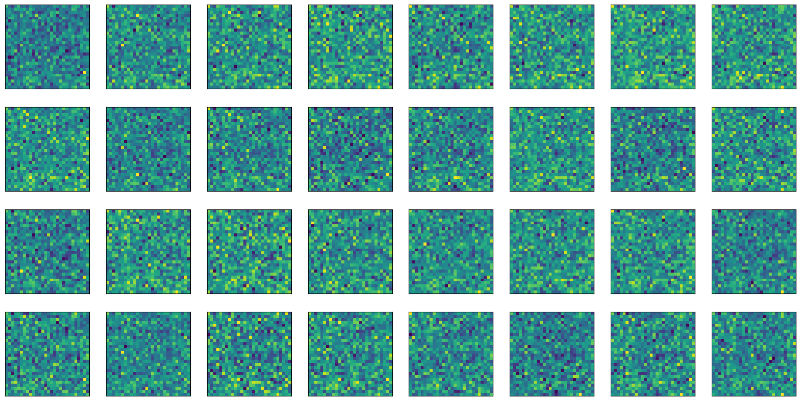
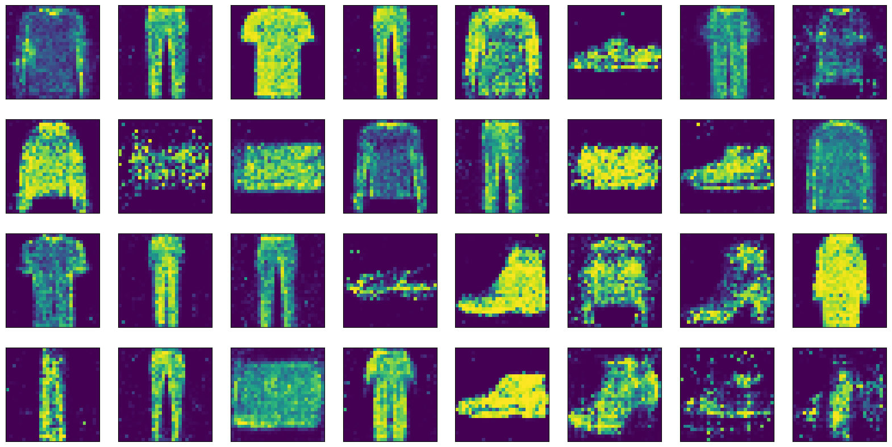

# 🧠 GAN — Fashion MNIST

A Generative Adversarial Network (GAN) trained on the Fashion MNIST dataset to generate new clothing images from random noise.

---

## 📌 Overview

| | |
|---|---|
| 📌 Tools | Python, PyTorch, torchvision, Matplotlib |
| 📅 Dataset | Fashion MNIST — 60,000 clothing images |
| 🎯 Goal | Generate realistic clothing images using GAN |
| ⚙️ Training | 30 epochs, Adam optimizer, BCELoss |

---

## 🏗️ Architecture

| Component | Architecture | Role |
|-----------|-------------|------|
| **Generator** | Linear(100→256→512→1024→784) + Tanh | Generates images from noise |
| **Discriminator** | Linear(784→1024→512→256→1) + Sigmoid | Classifies real vs. fake |
| **Loss** | BCELoss | Binary classification |
| **Optimizer** | Adam (lr=0.0001) | Gradient descent |

---

## 📈 Results

### Before Training (Epoch 0) — Pure noise

### After Training (Epoch 30) — Generated clothing


---

## 🚀 How to Run

**On Kaggle:**
1. Upload `gan-fashionmnist-kaggle.ipynb` to Kaggle
2. Enable GPU accelerator
3. Run All cells

**Locally:**
```bash
git clone https://github.com/Mirjalol-Eshmurodov/gan-fashionmnist.git
cd gan-fashionmnist
pip install -r requirements.txt
jupyter notebook gan-fashionmnist-kaggle.ipynb
```

---

## 💡 Next Steps
- **DCGAN** — Convolutional layers for higher image quality
- **Conditional GAN** — Generate a specific clothing category on demand
- **WGAN** — Improve training stability with Wasserstein loss

---

## 📁 Project Structure

```
gan-fashionmnist/
├── gan-fashionmnist-kaggle.ipynb   # Main notebook
├── requirements.txt                 # Dependencies
├── .gitignore                       # Git ignore rules
├── README.md                        # This file
└── results/
    ├── epoch_00.png                 # Before training
    ├── epoch_10.png                 # Epoch 10
    ├── epoch_20.png                 # Epoch 20
    └── epoch_30.png                 # Final result
```
